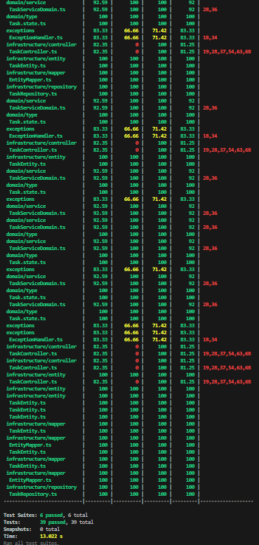

# CRUD de tareas

## Estructura de Arquitectura hexagonal

```textplain
src
├── application
│   ├── DTO
│   │   └── TaskDTO.ts
│   ├── mapper
│   │   └── TaskMapper.ts
│   └── service
│       └── TaskServiceApplication.ts
├── domain
│   ├── entity
│   │   └── Task.ts
│   ├── port
│   │   ├── in
│   │   │   └── TaskInterfacePortIn.ts
│   │   └── out
│   │       └── TaskInterfacePortOut.ts
│   ├── service
│   │   └── TaskServiceDomain.ts
│   └── type
│       └── Task.state.ts
├── infrastructure
│   ├── controller
│   │   └── TaskController.ts
│   ├── entity
│   │   └── TaskEntity.ts
│   ├── mapper
│   │   └── EntityMapper.ts
│   └── repository
│       └── TaskRepository.ts
├── app.module.ts
└── main.ts
test
├── application
│   ├── mapper
│   │   └── TaskMapper.spec.ts
│   └── service
│       └── TaskServiceApplication.spec.ts
├── domain
│   └── service
│       └── TaskServiceDomain.spec.ts
└── infrastructure
    ├── controller
    │   └── TaskController.spec.ts
    ├── mapper
    │   └── EntityMapper.spec.ts
    └── repository
        └── TaskRepository.spec.ts

```

Este proyecto es una API de gestión de tareas desarrollada en **NestJS**. Permite crear, actualizar, eliminar y consultar tareas, siguiendo un enfoque modular y escalable. A continuación, se detalla cómo instalar y ejecutar el proyecto localmente utilizando Docker Compose.

---

## Requisitos

- Docker
- Docker Compose

---

## Instalación y Ejecución

1. Clona el repositorio:

   ```bash
     git clone https://github.com/jadodev/task-compose.git
   ```

2. Navega a:
  ```textplain
    cd task-compose
  ```

3. Inicia el servidor con:
 ```textplain
  docker-compose up
 ```

### Endpoints
Crear una Tarea (POST /tasks)
- Recibe un objeto JSON con el título y el estado de la tarea. El estado solo puede ser uno de los siguientes:

PENDIENTE, EN_PROCESO, COMPLETADA, CANCELADA

- Ejemplo de solicitud POST:
```bash
{
  "title": "Nueva Tarea",
  "state": "PENDIENTE"
}
```

- Actualizar una Tarea (PUT /tasks/:id)
Recibe el id de la tarea como parámetro en la URL y un objeto JSON con los campos a actualizar.

Ejemplo de solicitud:

```bash
{
  "title": "Tarea Actualizada",
  "state": "EN_PROCESO"
}
```

- Eliminar una Tarea (DELETE /tasks/:id)
Recibe el id de la tarea como parámetro en la URL y elimina la tarea correspondiente.

- Obtener una Tarea por ID (GET /tasks/:id)
Recibe el id de la tarea como parámetro en la URL y devuelve la tarea correspondiente.

- Obtener Todas las Tareas (GET /tasks)
Devuelve un listado de todas las tareas almacenadas.

## Manejo de Errores
Si se intenta acceder a una ruta no válida, la API devuelve un objeto de error con el mensaje Ruta no encontrada.
Si se intenta crear una tarea con un estado no válido, la API devuelve un error indicando los estados permitidos.

## End Points para peticiones:

- GET:
```bash
  http://alb-1-1267904391.us-east-1.elb.amazonaws.com/task
```

- GET/ID:
```bash
    http://alb-1-1267904391.us-east-1.elb.amazonaws.com/task/{id}
```

- POST:
```bash
    http://alb-1-1267904391.us-east-1.elb.amazonaws.com/task
```

- PUT:
```bash
    http://alb-1-1267904391.us-east-1.elb.amazonaws.com/task/{id}
```
- DELETE:
```bash
    http://alb-1-1267904391.us-east-1.elb.amazonaws.com/task/{id}
```
## Coverage de pruebas.




